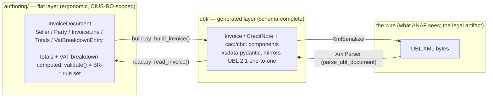
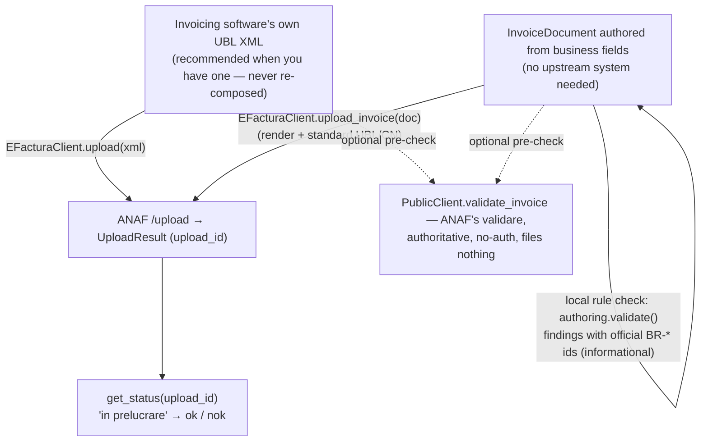
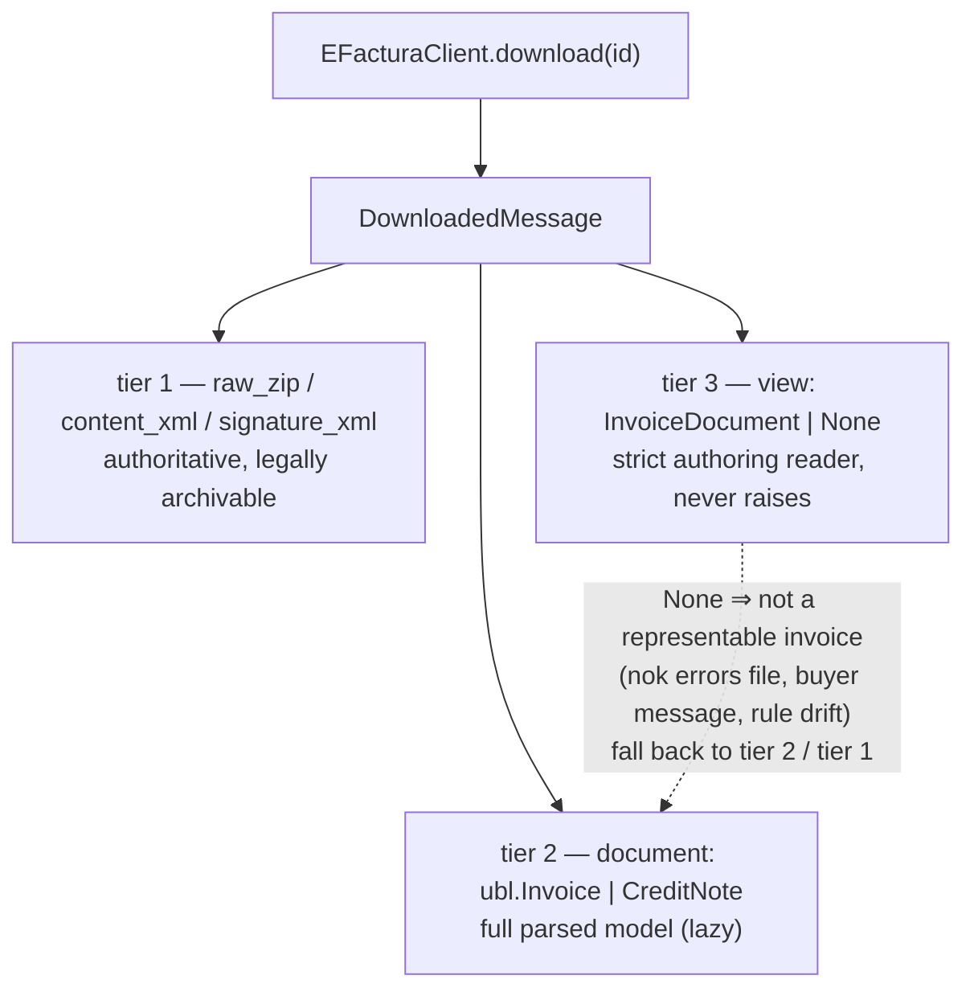

# `anafpy.efactura` — how the pieces fit

Three representations of the same invoice, one conversion layer between each,
and a client that moves the bytes. Deep detail lives in the
[docs site](https://anafpy.readthedocs.io) and `DESIGN.md` §4; this is the map.

## The model stack

- **`render_invoice(doc)`** = `build_invoice` + `XmlSerializer` (validates first
  unless `skip_validation=True`).
- **`parse_invoice(xml)`** = `parse_ubl_document` + `read_invoice`.
- Round-trips are **byte-stable**: `render(parse(render(doc))) == render(doc)`.
- The generated layer is the only place XML is touched — the flat models never
  serialize themselves, and nothing here is hand-written serializer code.

## Outbound: two ways in, one upload

Through MCP the same two shapes are `efactura_prepare` (XML pass-through) and
`efactura_prepare_invoice` (composed), both behind the two-step confirmation
gate, then `efactura_submit` → `efactura_get_status`.

## Inbound: one download, three read tiers

Tier 3 is the same flat model you author with, read full-fidelity from the wire
(amounts land in the explicit fields, never recomputed) — so a received invoice
is one edit away from a drafted credit note, and `validate()` can judge an
upstream document's arithmetic. Strictness is safe here: everything in the
inbox already passed ANAF's validation, whose rules the flat models mirror.

## Who owns what

| Piece | Source of truth | Regenerate / edit |
|---|---|---|
| `ubl/` | vendored OASIS UBL 2.1 XSDs (`schemas/ubl-2.1/`) | `scripts/generate_ubl.py` — never hand-edit |
| `authoring/_codelists.py` | vendored EN 16931 Schematron (`schemas/efactura/schematron/`) | `scripts/generate_efactura_codelists.py` — never hand-edit |
| `authoring/` (rest) | hand-written; rules translated from the CIUS-RO 1.0.9 Schematron | edit normally, keep rule ids honest |
| `client.py`, `models.py` | hand-written transport + value types | edit normally |
